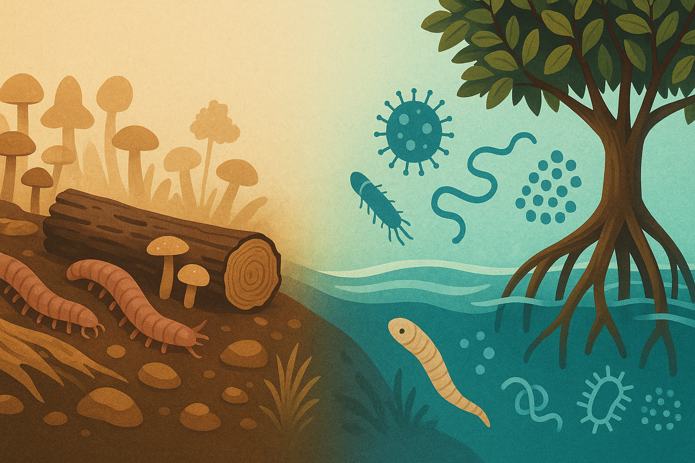

  

# 👋 Hello! I'm Imelda Forteza
🌿 **Ecology. Microbes. Mangroves. Climate Solutions.Science Storyteller.** 
Curious about the hidden lives of microbes,blue carbon,GHG — from forest floors to mangrove roots.

---

🧬 **About Me**  
I’m an environmental scientist and microbial ecologist working at the nexus of biodiversity, blue carbon, and ecosystem resilience. My research investigates how microbial communities influence carbon cycling, symbioses, and ecological function — spanning forest-floor invertebrates, mangrove sediments, marine environments, and restored wetlands.

My work supports climate-informed conservation and nature-based solutions by linking gut microbiomes, greenhouse gas (GHG) emissions, and ecosystem restoration. I’m passionate about bridging science, communication, and policy, and I’m actively seeking roles in international NGOs, UN programs, and mission-driven industries focused on biodiversity, climate mitigation, and sustainable development.

---

🛠️ **Skills & Interests**  
- Microbiome Analysis | R, QIIME2, DESeq2  
- Metagenomics & Bioinformatics | Oxford Nanopore, Illumina  
- Ecosystem Ecology | Forest floors, wetlands, mangroves, and the San Pedro Ocean Time Series  
- Science Communication & Storytelling | GitHub Pages, R Markdown  
- Research Training & Capacity Building | Mentoring, lab management, education  

---

🔍 **Current Projects**  
- `velvetworm-gutmicrobiome` — R scripts and data for gut microbial dynamics in velvet worms  
- **Guardians of the Tide** — A storytelling + science project on mangrove microbiomes and blue carbon  
- **Bdellovibrio & Phage Predation** — Exploring synergistic and competitive predation using single-cycle kinetics in wild-type Gram-negative hosts  
- **Breathing Blue** — A developing initiative connecting microbial ecology, climate storytelling, and ecosystem healing in coastal communities  
 
---

🏅 **Awards & Fellowships**
 - **Breathing Blue** — A flagship science-policy storytelling initiative on Philippine mangroves, microbiomes, and coastal climate resilience.  
  🏅 *Co-awardee of the 2025 Creative Conservation Scholarship (Creature Conserve, USA)*  
  Focused on producing science-informed public engagement materials and policy-relevant narratives that explore the role of microbial ecology in biodiversity protection, blue carbon systems, and nature-based climate solutions.

---

📚 **Publications & Profiles**

  

**Selected Publications:**

- 🧬 *SARS-CoV-2 Replication Revisited: Molecular Insights and Current and Emerging Antiviral Strategies*  
  Subong, B. J. J., Forteza, I. L. **COVID (MDPI), 2025**  
  

- 🧪 *Synergistic Anti-MRSA Activity and Absolute Stereochemistry of 7,8-Dideoxygriseorhodin C*  
  Miller, B. W., Torres, J. P., Tun, J. O., Flores, M. S., Forteza, I. L., et al. **Journal of Antibiotics (2020)**  
  

- 🌊 *Discovery of Chemoautotrophic Symbiosis in the Giant Shipworm Kuphus polythalamia*  
  Distel, D., Altamia, M., Lin, Z., Shipway, J. R., Forteza, I., et al. **PNAS (2017)**  
  

- 🧠 *Neuroactive Diol and Acyloin Metabolites from Cone Snail-Associated Bacteria*  
  Lin, Z., Marett, L., Hughen, R. W., Forteza, I., et al. **Bioorganic & Med Chem Lett (2013)**  
  

- 🌀 *Totopotensamides: Polyketide-Cyclic Peptide Hybrids from a Mollusk-Associated Streptomyces*  
  Lin, Z., Flores, M. S., Forteza, I., et al. **Journal of Natural Products (2012)**  
  

---

📝 **Preprints / In Review**  
- *Microbiome Composition and Spatial Patterns in Saproxylic Velvet Worms from Deadwood Microhabitats* —   
  *(bioRxiv link to be added upon preprint upload)*

- *Bdellovibrio and Phage Predation Kinetics in Wild-Type Gram-Negative Hosts* — **in prep**  
  *(preprint coming soon)*

---

🤝 **Let’s Connect**

  
📍 Remote-friendly 🌏

---

📌 *“I believe the smallest things often tell the biggest stories — and microbes have a lot to say.”*
